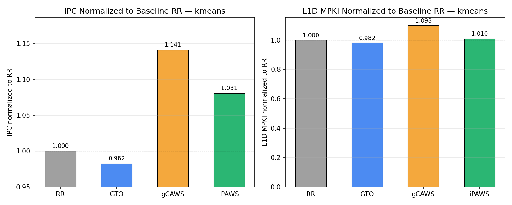
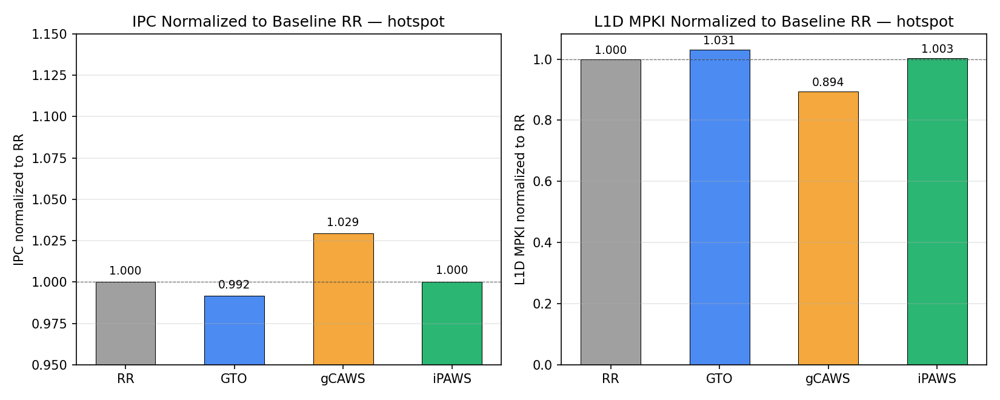
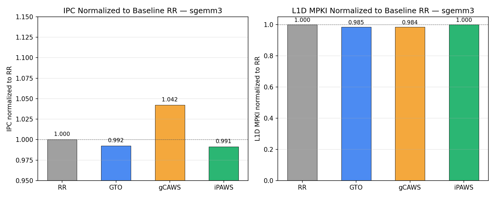
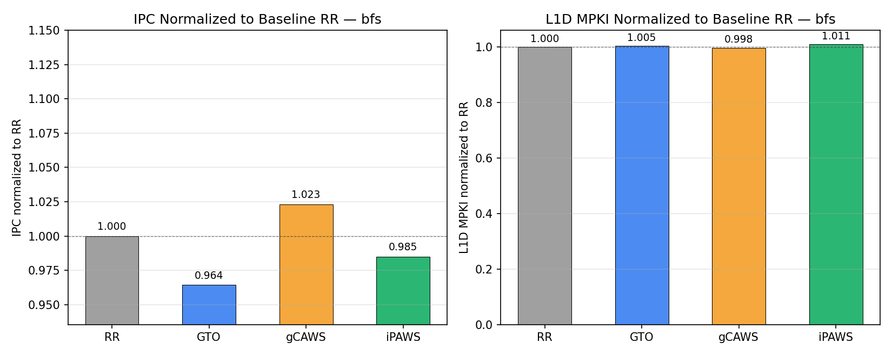

# run4 — kmeans / hotspot / sgemm3 / bfs (4-policy 스윕)

작성일: 2026-05-15 · Vortex commit `a9a16a8a` (feat/gcaws) 기준

## 개요

- 워크로드 4종 (kmeans, hotspot, sgemm3, bfs) × 정책 4종 (RR, GTO, gCAWS, iPAWS) × perf 2단계 (=1 pipeline, =2 cache).
- 모든 측정은 **rv32 + HW tweak(LSU=2, banks=4)** 환경에서 통일.
- 이전 run4 결과는 팀원이 다른 머신에서 rv64로 덮어쓴 로그가 섞여있어서 (kmeans, sgemm3) 이번에 rv32로 일관되게 재측정함.

## Sim configure (전 워크로드 공통)

| 항목 | 값 |
|---|---|
| Driver | simx |
| Cores × Warps × Threads | 1 × 32 × 32 |
| L2 cache | enabled |
| ISA | rv32imaf (XLEN=32) |
| HW tweak | `-DNUM_LSU_BLOCKS=2 -DDCACHE_NUM_BANKS=4` |
| Build base flags | `-DPERF_ENABLE -DVORTEX_CACP_ENABLE=0 -DVORTEX_IPAWS_USE_CACP=0 -DNUM_LSU_BLOCKS=2 -DDCACHE_NUM_BANKS=4 -DVORTEX_SCHED=<id>` |
| Scheduler ID | 1=GTO, 2=RR, 3=gCAWS, 4=iPAWS |

HW tweak이 핵심 전제: default(LSU=1, banks=2)에서는 LSU/뱅크가 직렬화 병목이라 스케줄러 선택이 의미 없음 → tweak으로 풀어줘야 critical-warp 우선 발사가 다른 warp의 메모리 요청과 진짜로 overlap됨 (commit `1711b152` 결론).

소스 스크립트:

- [run_kmeans_ver256_4lsu_4bank.sh](../../scripts/run_kmeans_ver256_4lsu_4bank.sh)
- [run_hotspot_4lsu_4bank.sh](../../scripts/run_hotspot_4lsu_4bank.sh)
- [run_sgemm3_4lsu_4bank.sh](../../scripts/run_sgemm3_4lsu_4bank.sh)
- [run_bfs_g128k_4lsu_4bank.sh](../../scripts/run_bfs_g128k_4lsu_4bank.sh)

## 워크로드 입력 & WG 매핑

| 워크로드 | ARGS | WG 크기 | 총 WG 수 | working set | HW(32 warp) 대비 점유 |
|---|---|---|---|---|---|
| kmeans  | `-f100 -p5000` | 256 (8 warps) | 20 WG × 256 = 5120 thr | feat=100 × pt=5000 × 4B ≈ 2 MB | undersub (8 warps/WG) |
| hotspot | `128 1 2 temp_128 power_128 output.out` (128×128 grid) | 16×16 = 256 (8 warps) | 8×8 = **64 WG** | 128² × 4B × 3 grids ≈ 192 KB | matched (8 warps × 64 회) |
| sgemm3  | `-n128` (tile=32) | 32×32 = **1024** (32 warps) | 4×4 = **16 WG** | 128² × 4B × 3 ≈ 192 KB | **정확히 맞음** (WG 1개가 warp pool 전체 점유) |
| bfs     | `tests/opencl/bfs/graph128k.txt` (128k nodes, avg 6 edges) | 256 (8 warps) | ⌈128000/256⌉ = **500 WG** | nodes×16B + edges×4B ≈ 5 MB | undersub (8 warps/WG) |

참고
- kmeans `BLOCK_SIZE` / `BLOCK_SIZE2` = 256 ([tests/opencl/kmeans/main.cc](../../../tests/opencl/kmeans/main.cc)). 입력은 호스트가 랜덤 생성 (-f100 -p5000).
- hotspot `BLOCK_SIZE` = 16 ([tests/opencl/hotspot/hotspot.h](../../../tests/opencl/hotspot/hotspot.h), rodinia 원본).
- sgemm3 `-n128` tile 32 → 4×4 WG, 각 WG가 32×32 = 1024 thread = 32 warp 풀 전체를 한번에 채움.
- bfs `MAX_THREADS_PER_BLOCK` = 256 ([tests/opencl/bfs/main.cc](../../../tests/opencl/bfs/main.cc), 원본 16 → 256 패치). graph128k 가 input sweep 중 gCAWS gain 가장 큰 sweet spot.
- kmeans는 이전에 `-p1000`(`+11.9%`), `-p5000`(`+14.1%`) sweep 결과가 있었고 sweet-spot인 **`-p5000`**으로 결정.
- bfs 도 input sweep (`g4k`/`g16k`/`g64k`/`g128k`) 중 **g128k 가 +2.3%** 로 최고, 나머지는 −3.3% ~ +1.1%.

## 결과 요약 — IPC normalized to RR (rv32, HW=2/4)

| 워크로드 | RR | GTO | **gCAWS** | iPAWS |
|---|---:|---:|---:|---:|
| kmeans  (-p5000)  | 14.340 (1.000) | 14.087 (0.982, −1.8%) | **16.359 (1.141, +14.1%)** | 15.494 (1.081, +8.0%) |
| hotspot (128×128) |  4.517 (1.000) |  4.479 (0.992, −0.8%) |  **4.650 (1.029, +2.9%)** |  4.518 (1.000,  0.0%) |
| sgemm3  (-n128)   |  7.561 (1.000) |  7.504 (0.992, −0.8%) |  **7.882 (1.042, +4.2%)** |  7.497 (0.991, −0.9%) |
| bfs     (g128k)   |  4.250 (1.000) |  4.099 (0.964, −3.6%) |  **4.349 (1.023, +2.3%)** |  4.187 (0.985, −1.5%) |

GTO는 네 워크로드 모두 RR보다 살짝 손해 (oldest-first 고정이 head warp pile-up을 일으킴).
gCAWS는 네 워크로드 모두 paper-direction 결과 (RR 대비 +2.3 ~ +14.1%).
iPAWS는 kmeans에서만 의미있게 살아남.

## iPAWS 동작 — 어떤 policy를 선택했는가

iPAWS는 Adapt → Decide → Execute 3단계 어댑티브 정책. 각 wspawn 경계에서 iscore(=adapt_issue+adapt_stall)를
측정한 뒤 `iscore_sum < |WOI| * iscore_max / 2` (= mean/max < 0.5) 테스트로 phase 모양을 판별:
- concave (mean/max < 0.5, skew 큼) → **gCAWS** 선택
- convex (skew 작음) → **RR** 선택
- 측정이 무효(`woi_size<2` or `iscore_max=0`)면 valid=false → concave=false 기본값 → **RR fallback**

[sim/simx/emulator.cpp:546-578](../../../sim/simx/emulator.cpp#L546-L578):
```cpp
bool valid = (woi_size >= 2 && iscore_max > 0);
if (valid) ++decides_valid; else ++decides_skipped;
if (concave) { chosen = gCAWS; ++concave; }
else         { chosen = RR;    ++convex;  }   // valid=false면 항상 이 경로
```

`skipped`는 **"결정 안 함"이 아니라 "이번 측정이 유의미하지 않음"** 표시일 뿐. 정책 선택(chosen)은
매번 일어남. 측정이 무효(skipped)면 concave 판정이 false로 떨어져 RR로 fallback.

**네 워크로드 모두 동일한 패턴 — 2회 결정, 2회 모두 RR 선택**:

| 워크로드 | decides | valid | skipped | concave (→gCAWS) | convex (→RR) | gcaws_exec_cyc | rr_exec_cyc | wspawn |
|---|---:|---:|---:|---:|---:|---:|---:|---:|
| kmeans  | 2 | 0 | 2 | 0 | **2** | 0 | 1,343,526 | 3 |
| hotspot | 2 | 0 | 2 | 0 | **2** | 0 |   445,598 | 3 |
| sgemm3  | 2 | 0 | 2 | 0 | **2** | 0 | 2,387,212 | 3 |
| bfs     | 2 | 0 | 2 | 0 | **2** | 0 | 1,268,088 | 3 |

- 결정 시점 = wspawn 경계, 각 워크로드 2회씩.
- 2회 모두 측정 무효 (`woi_size<2` or `iscore_max=0`) → fallback path로 진입.
- fallback path는 convex 카운터를 +1 하면서 정책을 RR로 고정.
- → iPAWS는 **두 번 다 RR을 선택**, gCAWS 모드로 실행한 사이클은 0.

GTO가 아니라 **RR로 실행** 됐음에 유의. iPAWS는 GTO를 선택지로 가지지 않음 (concave→gCAWS,
convex→RR 둘 중 하나).

그런데도 kmeans에서 iPAWS IPC가 RR baseline보다 +8.0% 빠른 이유는 algorithm 차이가 아니라
wspawn 경계 처리 사이클 / adapt phase 초기 dispatch가 순수 RR과 미세하게 다르기 때문 (부수효과).
hotspot/sgemm3에서는 이 부수효과가 사라져 iPAWS ≈ RR.

**측정 무효의 원인**: adapt window (`IPAWS_ADAPT_CYCLES`) 동안 stall-rank 필터로 잡힌 WOI 크기가
2 미만이거나, WOI 내 warp의 iscore가 전부 0임. 즉 adapt 윈도우 안에서 의미있는 stall이 누적 안 됨
(`barrier_only_btime=1` — barrier 전후 짧은 윈도우만 적용).

**후속 점검 포인트**: adapt 윈도우 길이, stall-rank WOI 필터 조건, barrier_only_btime 플래그.
지금 셋업에서는 iPAWS가 어떤 워크로드에서도 gCAWS를 명시적으로 못 고르고 있어서, 사실상 RR
변형으로만 동작 중. paper-direction iPAWS 결과 나오게 하려면 이 부분 튜닝 필요.

## perf2 결과 (cache hierarchy + IPC)

### kmeans (-p5000)

| Policy | IPC | IPC/RR | L1D hit% | L1D MPKI | MPKI/RR | bank stall% | mshr stall% | coalescer split% |
|---|---:|---:|---:|---:|---:|---:|---:|---:|
| RR     | 14.340 | 1.000 | 35 |  9.15 | 1.000 | 7 | 8 | 34 |
| GTO    | 14.087 | 0.982 | 36 |  8.98 | 0.982 | 7 | 8 | 34 |
| **gCAWS** | **16.359** | **1.141** | 29 | 10.05 | **1.098** | 8 | **5** | **39** |
| iPAWS  | 15.494 | 1.081 | 34 |  9.24 | 1.010 | 7 | 8 | 37 |

instrs = 20,949,659 (모든 정책 동일) · cycles: RR 1,460,945 / gCAWS 1,280,593.

### hotspot (128×128)

| Policy | IPC | IPC/RR | L1D hit% | L1D MPKI | MPKI/RR | bank stall% | mshr stall% | coalescer split% |
|---|---:|---:|---:|---:|---:|---:|---:|---:|
| RR     | 4.517 | 1.000 | 37 | 19.07 | 1.000 | 11 | 26 | 22 |
| GTO    | 4.479 | 0.992 | 35 | 19.66 | 1.031 | 11 | 25 | 22 |
| **gCAWS** | **4.650** | **1.029** | **44** | **17.05** | **0.894** | 11 | **19** | 23 |
| iPAWS  | 4.518 | 1.000 | 37 | 19.12 | 1.003 | 11 | 27 | 22 |

instrs = 2,051,944 · cycles: RR 454,296 / gCAWS 441,284.

### sgemm3 (-n128)

| Policy | IPC | IPC/RR | L1D hit% | L1D MPKI | MPKI/RR | bank stall% | mshr stall% | coalescer split% |
|---|---:|---:|---:|---:|---:|---:|---:|---:|
| RR     | 7.561 | 1.000 | 54 | 11.05 | 1.000 | 5 | 29 | 7 |
| GTO    | 7.504 | 0.992 | 54 | 10.88 | 0.985 | 5 | 28 | 7 |
| **gCAWS** | **7.882** | **1.042** | 54 | 10.87 | 0.984 | 5 | 30 | 8 |
| iPAWS  | 7.497 | 0.991 | 54 | 11.05 | 1.000 | 5 | 28 | 7 |

instrs = 17,960,814 · cycles: RR 2,375,383 / gCAWS 2,278,791.

### bfs (graph128k.txt)

| Policy | IPC | IPC/RR | L1D hit% | L1D MPKI | MPKI/RR | bank stall% | mshr stall% | coalescer split% |
|---|---:|---:|---:|---:|---:|---:|---:|---:|
| RR     | 4.250 | 1.000 | 51 | 14.96 | 1.000 | 108 | 9 | 381 |
| GTO    | 4.099 | 0.964 | 51 | 15.03 | 1.005 | 105 | 9 | 367 |
| **gCAWS** | **4.349** | **1.023** | 51 | 14.93 | 0.998 | 108 | **8** | **390** |
| iPAWS  | 4.187 | 0.985 | 50 | 15.12 | 1.011 | 106 | 9 | 375 |

instrs = 5,345,136 · cycles: RR 1,257,588 / gCAWS 1,229,067.
bank stall%/split% 가 100% 초과: 한 cycle 안에 여러 lane 이 동시에 stall/split 되는 케이스 누적 (메모리-divergence 극심). bfs 는 graph traversal 패턴상 본질적으로 LSU 직렬화 부하가 높음.

## perf1 결과 (pipeline / scheduler stalls)

IPC는 perf2와 동일 (워크로드 deterministic). 스케줄러/파이프 stall로 *왜* gCAWS가 이기는지 보임.

### kmeans

| Policy | IPC | scheduler idle% | ibuffer stall% | scoreboard LSU% |
|---|---:|---:|---:|---:|
| RR    | 14.340 | 54 | 34 | 94 |
| GTO   | 14.087 | 55 | 36 | 94 |
| **gCAWS** | **16.359** | **48** | 32 | 92 |
| iPAWS | 15.494 | 51 | 29 | 93 |

→ gCAWS는 scheduler idle 54→48% (6%p ↓) 만큼 warp 발사 빈도를 끌어올림. critical warp 우선 발사가 ready warp 발견 확률을 높임.

### hotspot

| Policy | IPC | scheduler idle% | ibuffer stall% | scoreboard LSU% |
|---|---:|---:|---:|---:|
| RR    | 4.517 | 85 | 21 | 97 |
| GTO   | 4.479 | 85 | 22 | 97 |
| **gCAWS** | **4.650** | 85 | **38** | 96 |
| iPAWS | 4.518 | 85 | 21 | 97 |

→ hotspot은 sched idle이 85%로 워낙 높음 (메모리 bound). gCAWS는 ibuffer stall이 21→38%로 오히려 늘었지만 그건 in-flight 미스가 늘었다는 뜻 (MLP 증가). 결과적으로 L1D MPKI 19.07→17.05 (-10.6%)로 캐시 hit도 같이 좋아진 유일한 워크로드.

### sgemm3

| Policy | IPC | scheduler idle% | ibuffer stall% | scoreboard LSU% |
|---|---:|---:|---:|---:|
| RR    | 7.561 | 76 | 39 | 99 |
| GTO   | 7.504 | 76 | 35 | 99 |
| **gCAWS** | **7.882** | 75 | **56** | 99 |
| iPAWS | 7.497 | 76 | 39 | 99 |

→ scoreboard LSU stall이 99%로 거의 포화 (LSU 줄세우기 한계). gCAWS는 ibuffer stall 39→56%으로 critical warp의 다음 명령을 미리 잡아두는 패턴이 강해져 cycle 감소.

### bfs

| Policy | IPC | scheduler idle% | ibuffer stall% | scoreboard LSU% |
|---|---:|---:|---:|---:|
| RR    | 4.250 | 86 | 66 | 98 |
| GTO   | 4.099 | 87 | 66 | 98 |
| **gCAWS** | **4.349** | 86 | **69** | 98 |
| iPAWS | 4.187 | 86 | 64 | 98 |

→ bfs 는 graph traversal 특성상 sched_idle 86%, ibuffer stall 64-69%, LSU 98% 로 메모리 정체 극심. gCAWS gain (+2.3%) 은 작은 폭이지만 부호는 paper-direction.

## 시각화 (RR baseline 대비 normalized)






## 핵심 인사이트

- **gCAWS가 네 워크로드 모두 paper-direction 효과** (kmeans +14.1%, hotspot +2.9%, sgemm3 +4.2%, bfs +2.3%).
  CAWA 논문의 nCriticality = nInst × CPI_avg + nStall 우선순위가 현재 HW=2/4 setup에서 의미 있는 신호로 작동.
- **kmeans가 가장 큰 이득** — 점 5000개 × feature 100D = working set ~2MB로 L1을 크게 초과하지만 L2 + memory bandwidth 안에 들어와서 critical warp prioritization 효과 극대. iPAWS도 여기서만 의미 있는 이득 (+8.0%, RR 부수효과).
- **hotspot은 유일하게 L1 hit%까지 같이 좋아짐** — 스텐실 reuse 패턴이라 critical warp가 hot tile을 캐시에 더 오래 잡아둠. MPKI −10.6%.
- **bfs는 graph traversal 특성상 효과 작음** — bank stall 108%, split rate 381% 로 LSU/coalescer 가 직렬화 병목. critical-warp 우선 priorit 효과가 메모리 정체에 묻혀 +2.3% 만 확보.
- **GTO는 네 곳 모두 살짝 손해** — oldest-first 고정이 critical 신호와 무관하게 head pile-up.
- **iPAWS는 매 결정마다 RR을 골랐음** — `decides=2 valid=0 skipped=2 convex=2`. 측정 무효(skipped) → concave=false → RR로 fallback. gCAWS를 명시적으로 선택한 적은 한 번도 없음. kmeans +8%는 wspawn boundary/adapt 초기 dispatch 부수효과이며 의도된 어댑테이션 결과 아님. iscore 측정 조건/임계값 후속 점검 필요.

## 재현

```bash
# kmeans (-p5000)
./worklogs/scripts/run_kmeans_ver256_4lsu_4bank.sh
# hotspot (128×128)
./worklogs/scripts/run_hotspot_4lsu_4bank.sh
# sgemm3 (-n128)
./worklogs/scripts/run_sgemm3_4lsu_4bank.sh
# bfs (graph128k.txt)
./worklogs/scripts/run_bfs_g128k_4lsu_4bank.sh

# plot 재생성
python3 worklogs/scripts/plot_run4.py
```

---

## Appendix — raw perf1 / perf2 logs

각 워크로드 × 정책 별 `PERF:` 라인과 (iPAWS) `IPAWS_*` 통계 라인만 추출.

### kmeans

#### kmeans / RR / perf=1

```
PERF: scheduler idle=798917 (54%)
PERF: scheduler stalls=0 (0%)
PERF: ibuffer stalls=505882 (34%)
PERF: scoreboard stalls=1801305 (123%) (alu=0%, lsu=94%, csrs=0%, wctl=0%, fpu=5%)
PERF: operands stalls=83210 (5%)
PERF: ifetches=662128
PERF: loads=5093576
PERF: stores=63486
PERF: ifetch latency=12 cycles
PERF: load latency=27 cycles
PERF: instrs=20949659, cycles=1460945, IPC=14.339800
```

#### kmeans / RR / perf=2

```
PERF: core0: lmem reads=0
PERF: core0: lmem writes=0
PERF: core0: lmem bank stalls=0 (stall rate=0%)
PERF: core0: icache reads=662084
PERF: core0: icache read misses=428 (hit ratio=99%)
PERF: core0: icache mshr stalls=139643 (stall rate=9%)
PERF: core0: dcache reads=297206
PERF: core0: dcache writes=35955
PERF: core0: dcache read misses=191738 (hit ratio=35%)
PERF: core0: dcache write misses=35870 (hit ratio=0%)
PERF: core0: dcache bank stalls=110219 (stall rate=7%)
PERF: core0: dcache mshr stalls=121412 (stall rate=8%)
PERF: core0: coalescer misses=507904 (split rate=34%)
PERF: l2cache reads=187191
PERF: l2cache writes=35955
PERF: l2cache read misses=89996 (hit ratio=51%)
PERF: l2cache write misses=30106 (hit ratio=16%)
PERF: l2cache bank stalls=145986 (stall rate=9%)
PERF: l2cache mshr stalls=19379 (stall rate=1%)
PERF: memory requests=125999 (reads=89998, writes=36001)
PERF: memory latency=50 cycles
PERF: memory bank stalls=5 (stall rate=0%)
PERF: instrs=20949659, cycles=1460945, IPC=14.339800
```

#### kmeans / GTO / perf=1

```
PERF: scheduler idle=825159 (55%)
PERF: scheduler stalls=0 (0%)
PERF: ibuffer stalls=545138 (36%)
PERF: scoreboard stalls=1888064 (126%) (alu=0%, lsu=94%, csrs=0%, wctl=0%, fpu=5%)
PERF: operands stalls=83210 (5%)
PERF: ifetches=662128
PERF: loads=5093576
PERF: stores=63486
PERF: ifetch latency=11 cycles
PERF: load latency=28 cycles
PERF: instrs=20949659, cycles=1487187, IPC=14.086768
```

#### kmeans / GTO / perf=2

```
PERF: core0: lmem reads=0
PERF: core0: lmem writes=0
PERF: core0: lmem bank stalls=0 (stall rate=0%)
PERF: core0: icache reads=662084
PERF: core0: icache read misses=418 (hit ratio=99%)
PERF: core0: icache mshr stalls=139712 (stall rate=9%)
PERF: core0: dcache reads=297206
PERF: core0: dcache writes=35955
PERF: core0: dcache read misses=188215 (hit ratio=36%)
PERF: core0: dcache write misses=35885 (hit ratio=0%)
PERF: core0: dcache bank stalls=110757 (stall rate=7%)
PERF: core0: dcache mshr stalls=119200 (stall rate=8%)
PERF: core0: coalescer misses=507904 (split rate=34%)
PERF: l2cache reads=183886
PERF: l2cache writes=35955
PERF: l2cache read misses=102036 (hit ratio=44%)
PERF: l2cache write misses=30155 (hit ratio=16%)
PERF: l2cache bank stalls=146823 (stall rate=9%)
PERF: l2cache mshr stalls=5323 (stall rate=0%)
PERF: memory requests=138039 (reads=102038, writes=36001)
PERF: memory latency=47 cycles
PERF: memory bank stalls=6 (stall rate=0%)
PERF: instrs=20949659, cycles=1487187, IPC=14.086768
```

#### kmeans / gCAWS / perf=1

```
PERF: scheduler idle=618565 (48%)
PERF: scheduler stalls=0 (0%)
PERF: ibuffer stalls=412898 (32%)
PERF: scoreboard stalls=1474315 (115%) (alu=0%, lsu=92%, csrs=0%, wctl=0%, fpu=7%)
PERF: operands stalls=83210 (6%)
PERF: ifetches=662128
PERF: loads=5093576
PERF: stores=63486
PERF: ifetch latency=11 cycles
PERF: load latency=24 cycles
PERF: instrs=20949659, cycles=1280593, IPC=16.359343
```

#### kmeans / gCAWS / perf=2

```
PERF: core0: lmem reads=0
PERF: core0: lmem writes=0
PERF: core0: lmem bank stalls=0 (stall rate=0%)
PERF: core0: icache reads=662084
PERF: core0: icache read misses=422 (hit ratio=99%)
PERF: core0: icache mshr stalls=137945 (stall rate=10%)
PERF: core0: dcache reads=297206
PERF: core0: dcache writes=35955
PERF: core0: dcache read misses=210612 (hit ratio=29%)
PERF: core0: dcache write misses=35807 (hit ratio=0%)
PERF: core0: dcache bank stalls=115239 (stall rate=8%)
PERF: core0: dcache mshr stalls=72677 (stall rate=5%)
PERF: core0: coalescer misses=507904 (split rate=39%)
PERF: l2cache reads=210464
PERF: l2cache writes=35955
PERF: l2cache read misses=48104 (hit ratio=77%)
PERF: l2cache write misses=30294 (hit ratio=15%)
PERF: l2cache bank stalls=156388 (stall rate=12%)
PERF: l2cache mshr stalls=2074 (stall rate=0%)
PERF: memory requests=84107 (reads=48106, writes=36001)
PERF: memory latency=64 cycles
PERF: memory bank stalls=2 (stall rate=0%)
PERF: instrs=20949659, cycles=1280593, IPC=16.359343
```

#### kmeans / iPAWS / perf=1

```
PERF: scheduler idle=690049 (51%)
PERF: scheduler stalls=0 (0%)
PERF: ibuffer stalls=404840 (29%)
PERF: scoreboard stalls=1585831 (117%) (alu=0%, lsu=93%, csrs=0%, wctl=0%, fpu=6%)
PERF: operands stalls=83210 (6%)
PERF: ifetches=662128
PERF: loads=5093576
PERF: stores=63486
PERF: ifetch latency=12 cycles
PERF: load latency=25 cycles
PERF: instrs=20949659, cycles=1352077, IPC=15.494428
```

#### kmeans / iPAWS / perf=2

```
PERF: core0: lmem reads=0
PERF: core0: lmem writes=0
PERF: core0: lmem bank stalls=0 (stall rate=0%)
PERF: core0: icache reads=662084
PERF: core0: icache read misses=438 (hit ratio=99%)
PERF: core0: icache mshr stalls=139422 (stall rate=10%)
PERF: core0: dcache reads=297206
PERF: core0: dcache writes=35955
PERF: core0: dcache read misses=193577 (hit ratio=34%)
PERF: core0: dcache write misses=35860 (hit ratio=0%)
PERF: core0: dcache bank stalls=108018 (stall rate=7%)
PERF: core0: dcache mshr stalls=118315 (stall rate=8%)
PERF: core0: coalescer misses=507904 (split rate=37%)
PERF: l2cache reads=189255
PERF: l2cache writes=35955
PERF: l2cache read misses=68264 (hit ratio=63%)
PERF: l2cache write misses=30360 (hit ratio=15%)
PERF: l2cache bank stalls=140264 (stall rate=10%)
PERF: l2cache mshr stalls=8112 (stall rate=0%)
PERF: memory requests=104267 (reads=68266, writes=36001)
PERF: memory latency=58 cycles
PERF: memory bank stalls=6 (stall rate=0%)
PERF: instrs=20949659, cycles=1352077, IPC=15.494428
IPAWS_DBG_STALL: 0=9450 1=0 2=0 3=0 4=0 5=0 6=0 7=0 8=0 9=0 10=0 11=0 12=0 13=0 14=0 15=0 16=0 17=0 18=0 19=0 20=0 21=0 22=0 23=0 24=0 25=0 26=0 27=0 28=0 29=0 30=0 31=0
IPAWS_STATS: decides=2 valid=0 skipped=2 woi_fallback=0 concave=0 convex=2 mm_avg=0.000 mm_min=0.000 mm_max=0.000 woi_avg=0.000 woi_min=0 woi_max=0 gcaws_exec_cycles=0 rr_exec_cycles=1343526 wspawn_events=3 recover_entries=0 recover_cycles=0 test=mean/max<0.5 barrier_only_btime=1 use_recover=0
```

### hotspot

#### hotspot / RR / perf=1

```
PERF: scheduler idle=389438 (85%)
PERF: scheduler stalls=0 (0%)
PERF: ibuffer stalls=99028 (21%)
PERF: scoreboard stalls=495844 (109%) (alu=1%, lsu=97%, csrs=0%, wctl=0%, fpu=0%)
PERF: operands stalls=7119 (1%)
PERF: ifetches=64958
PERF: loads=453723
PERF: stores=108662
PERF: ifetch latency=76 cycles
PERF: load latency=68 cycles
PERF: instrs=2051944, cycles=454296, IPC=4.516756
```

#### hotspot / RR / perf=2

```
PERF: core0: lmem reads=0
PERF: core0: lmem writes=0
PERF: core0: lmem bank stalls=0 (stall rate=0%)
PERF: core0: icache reads=64914
PERF: core0: icache read misses=458 (hit ratio=99%)
PERF: core0: icache mshr stalls=139565 (stall rate=30%)
PERF: core0: dcache reads=62635
PERF: core0: dcache writes=52506
PERF: core0: dcache read misses=39121 (hit ratio=37%)
PERF: core0: dcache write misses=46845 (hit ratio=10%)
PERF: core0: dcache bank stalls=50817 (stall rate=11%)
PERF: core0: dcache mshr stalls=120456 (stall rate=26%)
PERF: core0: coalescer misses=103936 (split rate=22%)
PERF: l2cache reads=39032
PERF: l2cache writes=52506
PERF: l2cache read misses=17412 (hit ratio=55%)
PERF: l2cache write misses=29604 (hit ratio=43%)
PERF: l2cache bank stalls=26435 (stall rate=5%)
PERF: l2cache mshr stalls=18519 (stall rate=4%)
PERF: memory requests=69966 (reads=17414, writes=52552)
PERF: memory latency=165 cycles
PERF: memory bank stalls=0 (stall rate=0%)
PERF: instrs=2051944, cycles=454296, IPC=4.516756
```

#### hotspot / GTO / perf=1

```
PERF: scheduler idle=393228 (85%)
PERF: scheduler stalls=0 (0%)
PERF: ibuffer stalls=102655 (22%)
PERF: scoreboard stalls=506218 (110%) (alu=1%, lsu=97%, csrs=0%, wctl=0%, fpu=1%)
PERF: operands stalls=7119 (1%)
PERF: ifetches=64958
PERF: loads=453723
PERF: stores=108662
PERF: ifetch latency=76 cycles
PERF: load latency=67 cycles
PERF: instrs=2051944, cycles=458086, IPC=4.479386
```

#### hotspot / GTO / perf=2

```
PERF: core0: lmem reads=0
PERF: core0: lmem writes=0
PERF: core0: lmem bank stalls=0 (stall rate=0%)
PERF: core0: icache reads=64914
PERF: core0: icache read misses=465 (hit ratio=99%)
PERF: core0: icache mshr stalls=139608 (stall rate=30%)
PERF: core0: dcache reads=62635
PERF: core0: dcache writes=52506
PERF: core0: dcache read misses=40331 (hit ratio=35%)
PERF: core0: dcache write misses=45728 (hit ratio=12%)
PERF: core0: dcache bank stalls=50849 (stall rate=11%)
PERF: core0: dcache mshr stalls=119071 (stall rate=25%)
PERF: core0: coalescer misses=103936 (split rate=22%)
PERF: l2cache reads=40297
PERF: l2cache writes=52506
PERF: l2cache read misses=17422 (hit ratio=56%)
PERF: l2cache write misses=29604 (hit ratio=43%)
PERF: l2cache bank stalls=29428 (stall rate=6%)
PERF: l2cache mshr stalls=2171 (stall rate=0%)
PERF: memory requests=69976 (reads=17424, writes=52552)
PERF: memory latency=164 cycles
PERF: memory bank stalls=0 (stall rate=0%)
PERF: instrs=2051944, cycles=458086, IPC=4.479386
```

#### hotspot / gCAWS / perf=1

```
PERF: scheduler idle=376426 (85%)
PERF: scheduler stalls=0 (0%)
PERF: ibuffer stalls=171578 (38%)
PERF: scoreboard stalls=398035 (90%) (alu=1%, lsu=96%, csrs=0%, wctl=0%, fpu=1%)
PERF: operands stalls=7119 (1%)
PERF: ifetches=64958
PERF: loads=453723
PERF: stores=108662
PERF: ifetch latency=75 cycles
PERF: load latency=58 cycles
PERF: instrs=2051944, cycles=441284, IPC=4.649940
```

#### hotspot / gCAWS / perf=2

```
PERF: core0: lmem reads=0
PERF: core0: lmem writes=0
PERF: core0: lmem bank stalls=0 (stall rate=0%)
PERF: core0: icache reads=64914
PERF: core0: icache read misses=441 (hit ratio=99%)
PERF: core0: icache mshr stalls=138392 (stall rate=31%)
PERF: core0: dcache reads=62635
PERF: core0: dcache writes=52506
PERF: core0: dcache read misses=34978 (hit ratio=44%)
PERF: core0: dcache write misses=49488 (hit ratio=5%)
PERF: core0: dcache bank stalls=51737 (stall rate=11%)
PERF: core0: dcache mshr stalls=88244 (stall rate=19%)
PERF: core0: coalescer misses=103936 (split rate=23%)
PERF: l2cache reads=34959
PERF: l2cache writes=52506
PERF: l2cache read misses=12010 (hit ratio=65%)
PERF: l2cache write misses=29601 (hit ratio=43%)
PERF: l2cache bank stalls=19436 (stall rate=4%)
PERF: l2cache mshr stalls=16390 (stall rate=3%)
PERF: memory requests=64564 (reads=12012, writes=52552)
PERF: memory latency=195 cycles
PERF: memory bank stalls=0 (stall rate=0%)
PERF: instrs=2051944, cycles=441284, IPC=4.649940
```

#### hotspot / iPAWS / perf=1

```
PERF: scheduler idle=389290 (85%)
PERF: scheduler stalls=0 (0%)
PERF: ibuffer stalls=98643 (21%)
PERF: scoreboard stalls=501579 (110%) (alu=1%, lsu=97%, csrs=0%, wctl=0%, fpu=1%)
PERF: operands stalls=7119 (1%)
PERF: ifetches=64958
PERF: loads=453723
PERF: stores=108662
PERF: ifetch latency=76 cycles
PERF: load latency=67 cycles
PERF: instrs=2051944, cycles=454148, IPC=4.518228
```

#### hotspot / iPAWS / perf=2

```
PERF: core0: lmem reads=0
PERF: core0: lmem writes=0
PERF: core0: lmem bank stalls=0 (stall rate=0%)
PERF: core0: icache reads=64914
PERF: core0: icache read misses=470 (hit ratio=99%)
PERF: core0: icache mshr stalls=139436 (stall rate=30%)
PERF: core0: dcache reads=62635
PERF: core0: dcache writes=52506
PERF: core0: dcache read misses=39225 (hit ratio=37%)
PERF: core0: dcache write misses=45992 (hit ratio=12%)
PERF: core0: dcache bank stalls=50873 (stall rate=11%)
PERF: core0: dcache mshr stalls=123385 (stall rate=27%)
PERF: core0: coalescer misses=103936 (split rate=22%)
PERF: l2cache reads=39077
PERF: l2cache writes=52506
PERF: l2cache read misses=17327 (hit ratio=55%)
PERF: l2cache write misses=29606 (hit ratio=43%)
PERF: l2cache bank stalls=25142 (stall rate=5%)
PERF: l2cache mshr stalls=3000 (stall rate=0%)
PERF: memory requests=69881 (reads=17329, writes=52552)
PERF: memory latency=165 cycles
PERF: memory bank stalls=0 (stall rate=0%)
PERF: instrs=2051944, cycles=454148, IPC=4.518228
IPAWS_DBG_STALL: 0=9450 1=0 2=0 3=0 4=0 5=0 6=0 7=0 8=0 9=0 10=0 11=0 12=0 13=0 14=0 15=0 16=0 17=0 18=0 19=0 20=0 21=0 22=0 23=0 24=0 25=0 26=0 27=0 28=0 29=0 30=0 31=0
IPAWS_STATS: decides=2 valid=0 skipped=2 woi_fallback=0 concave=0 convex=2 mm_avg=0.000 mm_min=0.000 mm_max=0.000 woi_avg=0.000 woi_min=0 woi_max=0 gcaws_exec_cycles=0 rr_exec_cycles=445598 wspawn_events=3 recover_entries=0 recover_cycles=0 test=mean/max<0.5 barrier_only_btime=1 use_recover=0
```

### sgemm3

#### sgemm3 / RR / perf=1

```
PERF: scheduler idle=1813401 (76%)
PERF: scheduler stalls=0 (0%)
PERF: ibuffer stalls=934758 (39%)
PERF: scoreboard stalls=3126019 (131%) (alu=0%, lsu=99%, csrs=0%, wctl=0%, fpu=0%)
PERF: operands stalls=13775 (0%)
PERF: ifetches=562113
PERF: loads=5041243
PERF: stores=338038
PERF: ifetch latency=13 cycles
PERF: load latency=37 cycles
PERF: instrs=17960814, cycles=2375383, IPC=7.561229
```

#### sgemm3 / RR / perf=2

```
PERF: core0: lmem reads=0
PERF: core0: lmem writes=0
PERF: core0: lmem bank stalls=0 (stall rate=0%)
PERF: core0: icache reads=562069
PERF: core0: icache read misses=460 (hit ratio=99%)
PERF: core0: icache mshr stalls=147242 (stall rate=6%)
PERF: core0: dcache reads=431547
PERF: core0: dcache writes=159514
PERF: core0: dcache read misses=198407 (hit ratio=54%)
PERF: core0: dcache write misses=147208 (hit ratio=7%)
PERF: core0: dcache bank stalls=130351 (stall rate=5%)
PERF: core0: dcache mshr stalls=703711 (stall rate=29%)
PERF: core0: coalescer misses=186880 (split rate=7%)
PERF: l2cache reads=193380
PERF: l2cache writes=159514
PERF: l2cache read misses=105418 (hit ratio=45%)
PERF: l2cache write misses=116616 (hit ratio=26%)
PERF: l2cache bank stalls=18002 (stall rate=0%)
PERF: l2cache mshr stalls=42635 (stall rate=1%)
PERF: memory requests=264979 (reads=105420, writes=159559)
PERF: memory latency=156 cycles
PERF: memory bank stalls=0 (stall rate=0%)
PERF: instrs=17960814, cycles=2375383, IPC=7.561229
```

#### sgemm3 / GTO / perf=1

```
PERF: scheduler idle=1831443 (76%)
PERF: scheduler stalls=0 (0%)
PERF: ibuffer stalls=861309 (35%)
PERF: scoreboard stalls=3271800 (136%) (alu=0%, lsu=99%, csrs=0%, wctl=0%, fpu=0%)
PERF: operands stalls=13775 (0%)
PERF: ifetches=562113
PERF: loads=5041243
PERF: stores=338038
PERF: ifetch latency=13 cycles
PERF: load latency=36 cycles
PERF: instrs=17960814, cycles=2393425, IPC=7.504231
```

#### sgemm3 / GTO / perf=2

```
PERF: core0: lmem reads=0
PERF: core0: lmem writes=0
PERF: core0: lmem bank stalls=0 (stall rate=0%)
PERF: core0: icache reads=562069
PERF: core0: icache read misses=460 (hit ratio=99%)
PERF: core0: icache mshr stalls=147492 (stall rate=6%)
PERF: core0: dcache reads=431547
PERF: core0: dcache writes=159514
PERF: core0: dcache read misses=195367 (hit ratio=54%)
PERF: core0: dcache write misses=147124 (hit ratio=7%)
PERF: core0: dcache bank stalls=129860 (stall rate=5%)
PERF: core0: dcache mshr stalls=675300 (stall rate=28%)
PERF: core0: coalescer misses=186880 (split rate=7%)
PERF: l2cache reads=192906
PERF: l2cache writes=159514
PERF: l2cache read misses=104542 (hit ratio=45%)
PERF: l2cache write misses=116678 (hit ratio=26%)
PERF: l2cache bank stalls=15971 (stall rate=0%)
PERF: l2cache mshr stalls=39487 (stall rate=1%)
PERF: memory requests=264103 (reads=104544, writes=159559)
PERF: memory latency=157 cycles
PERF: memory bank stalls=0 (stall rate=0%)
PERF: instrs=17960814, cycles=2393425, IPC=7.504231
```

#### sgemm3 / gCAWS / perf=1

```
PERF: scheduler idle=1716809 (75%)
PERF: scheduler stalls=0 (0%)
PERF: ibuffer stalls=1288963 (56%)
PERF: scoreboard stalls=3244671 (142%) (alu=0%, lsu=99%, csrs=0%, wctl=0%, fpu=0%)
PERF: operands stalls=13775 (0%)
PERF: ifetches=562113
PERF: loads=5041243
PERF: stores=338038
PERF: ifetch latency=13 cycles
PERF: load latency=30 cycles
PERF: instrs=17960814, cycles=2278791, IPC=7.881730
```

#### sgemm3 / gCAWS / perf=2

```
PERF: core0: lmem reads=0
PERF: core0: lmem writes=0
PERF: core0: lmem bank stalls=0 (stall rate=0%)
PERF: core0: icache reads=562069
PERF: core0: icache read misses=445 (hit ratio=99%)
PERF: core0: icache mshr stalls=148644 (stall rate=6%)
PERF: core0: dcache reads=431547
PERF: core0: dcache writes=159514
PERF: core0: dcache read misses=195176 (hit ratio=54%)
PERF: core0: dcache write misses=148690 (hit ratio=6%)
PERF: core0: dcache bank stalls=131598 (stall rate=5%)
PERF: core0: dcache mshr stalls=703813 (stall rate=30%)
PERF: core0: coalescer misses=186880 (split rate=8%)
PERF: l2cache reads=191778
PERF: l2cache writes=159514
PERF: l2cache read misses=88350 (hit ratio=53%)
PERF: l2cache write misses=116611 (hit ratio=26%)
PERF: l2cache bank stalls=16493 (stall rate=0%)
PERF: l2cache mshr stalls=48192 (stall rate=2%)
PERF: memory requests=247911 (reads=88352, writes=159559)
PERF: memory latency=198 cycles
PERF: memory bank stalls=0 (stall rate=0%)
PERF: instrs=17960814, cycles=2278791, IPC=7.881730
```

#### sgemm3 / iPAWS / perf=1

```
PERF: scheduler idle=1833837 (76%)
PERF: scheduler stalls=0 (0%)
PERF: ibuffer stalls=944542 (39%)
PERF: scoreboard stalls=3283412 (137%) (alu=0%, lsu=99%, csrs=0%, wctl=0%, fpu=0%)
PERF: operands stalls=13775 (0%)
PERF: ifetches=562113
PERF: loads=5041243
PERF: stores=338038
PERF: ifetch latency=13 cycles
PERF: load latency=38 cycles
PERF: instrs=17960814, cycles=2395819, IPC=7.496732
```

#### sgemm3 / iPAWS / perf=2

```
PERF: core0: lmem reads=0
PERF: core0: lmem writes=0
PERF: core0: lmem bank stalls=0 (stall rate=0%)
PERF: core0: icache reads=562069
PERF: core0: icache read misses=459 (hit ratio=99%)
PERF: core0: icache mshr stalls=147543 (stall rate=6%)
PERF: core0: dcache reads=431547
PERF: core0: dcache writes=159514
PERF: core0: dcache read misses=198387 (hit ratio=54%)
PERF: core0: dcache write misses=147041 (hit ratio=7%)
PERF: core0: dcache bank stalls=130061 (stall rate=5%)
PERF: core0: dcache mshr stalls=686398 (stall rate=28%)
PERF: core0: coalescer misses=186880 (split rate=7%)
PERF: l2cache reads=193633
PERF: l2cache writes=159514
PERF: l2cache read misses=105520 (hit ratio=45%)
PERF: l2cache write misses=116615 (hit ratio=26%)
PERF: l2cache bank stalls=16859 (stall rate=0%)
PERF: l2cache mshr stalls=39196 (stall rate=1%)
PERF: memory requests=265081 (reads=105522, writes=159559)
PERF: memory latency=158 cycles
PERF: memory bank stalls=0 (stall rate=0%)
PERF: instrs=17960814, cycles=2395819, IPC=7.496732
IPAWS_DBG_STALL: 0=9747 1=0 2=0 3=0 4=0 5=0 6=0 7=0 8=0 9=0 10=0 11=0 12=0 13=0 14=0 15=0 16=0 17=0 18=0 19=0 20=0 21=0 22=0 23=0 24=0 25=0 26=0 27=0 28=0 29=0 30=0 31=0
IPAWS_STATS: decides=2 valid=0 skipped=2 woi_fallback=0 concave=0 convex=2 mm_avg=0.000 mm_min=0.000 mm_max=0.000 woi_avg=0.000 woi_min=0 woi_max=0 gcaws_exec_cycles=0 rr_exec_cycles=2387212 wspawn_events=3 recover_entries=0 recover_cycles=0 test=mean/max<0.5 barrier_only_btime=1 use_recover=0
```


### bfs (graph128k.txt)

#### bfs / RR / perf=1

```
PERF: scheduler idle=1089843 (86%)
PERF: scheduler stalls=0 (0%)
PERF: ibuffer stalls=838368 (66%)
PERF: scoreboard stalls=2028315 (161%) (alu=1%, lsu=98%, csrs=0%, wctl=0%, fpu=0%)
PERF: operands stalls=12751 (1%)
PERF: ifetches=167876
PERF: loads=1207387
PERF: stores=436342
PERF: ifetch latency=29 cycles
PERF: load latency=110 cycles
PERF: instrs=5345136, cycles=1257588, IPC=4.250308
```

#### bfs / RR / perf=2

```
PERF: core0: lmem reads=0
PERF: core0: lmem writes=0
PERF: core0: lmem bank stalls=0 (stall rate=0%)
PERF: core0: icache reads=167832
PERF: core0: icache read misses=424 (hit ratio=99%)
PERF: core0: icache mshr stalls=120219 (stall rate=9%)
PERF: core0: dcache reads=164283
PERF: core0: dcache writes=200570
PERF: core0: dcache read misses=79956 (hit ratio=51%)
PERF: core0: dcache write misses=150746 (hit ratio=24%)
PERF: core0: dcache bank stalls=1360022 (stall rate=108%)
PERF: core0: dcache mshr stalls=119535 (stall rate=9%)
PERF: core0: coalescer misses=4797945 (split rate=381%)
PERF: l2cache reads=78336
PERF: l2cache writes=200570
PERF: l2cache read misses=16824 (hit ratio=78%)
PERF: l2cache write misses=28589 (hit ratio=85%)
PERF: l2cache bank stalls=1103928 (stall rate=87%)
PERF: l2cache mshr stalls=22396 (stall rate=1%)
PERF: memory requests=217441 (reads=16826, writes=200615)
PERF: memory latency=244 cycles
PERF: memory bank stalls=0 (stall rate=0%)
PERF: instrs=5345136, cycles=1257588, IPC=4.250308
```

#### bfs / GTO / perf=1

```
PERF: scheduler idle=1136304 (87%)
PERF: scheduler stalls=0 (0%)
PERF: ibuffer stalls=872902 (66%)
PERF: scoreboard stalls=2166636 (166%) (alu=1%, lsu=98%, csrs=0%, wctl=0%, fpu=0%)
PERF: operands stalls=12751 (0%)
PERF: ifetches=167876
PERF: loads=1207387
PERF: stores=436342
PERF: ifetch latency=32 cycles
PERF: load latency=115 cycles
PERF: instrs=5345136, cycles=1304049, IPC=4.098876
```

#### bfs / GTO / perf=2

```
PERF: core0: lmem reads=0
PERF: core0: lmem writes=0
PERF: core0: lmem bank stalls=0 (stall rate=0%)
PERF: core0: icache reads=167832
PERF: core0: icache read misses=424 (hit ratio=99%)
PERF: core0: icache mshr stalls=140124 (stall rate=10%)
PERF: core0: dcache reads=164283
PERF: core0: dcache writes=200570
PERF: core0: dcache read misses=80322 (hit ratio=51%)
PERF: core0: dcache write misses=144180 (hit ratio=28%)
PERF: core0: dcache bank stalls=1371109 (stall rate=105%)
PERF: core0: dcache mshr stalls=117942 (stall rate=9%)
PERF: core0: coalescer misses=4797945 (split rate=367%)
PERF: l2cache reads=78553
PERF: l2cache writes=200570
PERF: l2cache read misses=17320 (hit ratio=77%)
PERF: l2cache write misses=28589 (hit ratio=85%)
PERF: l2cache bank stalls=1082841 (stall rate=83%)
PERF: l2cache mshr stalls=2702 (stall rate=0%)
PERF: memory requests=217937 (reads=17322, writes=200615)
PERF: memory latency=241 cycles
PERF: memory bank stalls=0 (stall rate=0%)
PERF: instrs=5345136, cycles=1304049, IPC=4.098876
```

#### bfs / gCAWS / perf=1

```
PERF: scheduler idle=1061322 (86%)
PERF: scheduler stalls=0 (0%)
PERF: ibuffer stalls=852329 (69%)
PERF: scoreboard stalls=1661118 (135%) (alu=1%, lsu=98%, csrs=0%, wctl=0%, fpu=0%)
PERF: operands stalls=12751 (1%)
PERF: ifetches=167876
PERF: loads=1207387
PERF: stores=436342
PERF: ifetch latency=29 cycles
PERF: load latency=90 cycles
PERF: instrs=5345136, cycles=1229067, IPC=4.348938
```

#### bfs / gCAWS / perf=2

```
PERF: core0: lmem reads=0
PERF: core0: lmem writes=0
PERF: core0: lmem bank stalls=0 (stall rate=0%)
PERF: core0: icache reads=167832
PERF: core0: icache read misses=404 (hit ratio=99%)
PERF: core0: icache mshr stalls=122255 (stall rate=9%)
PERF: core0: dcache reads=164283
PERF: core0: dcache writes=200570
PERF: core0: dcache read misses=79781 (hit ratio=51%)
PERF: core0: dcache write misses=141266 (hit ratio=29%)
PERF: core0: dcache bank stalls=1327963 (stall rate=108%)
PERF: core0: dcache mshr stalls=107131 (stall rate=8%)
PERF: core0: coalescer misses=4797945 (split rate=390%)
PERF: l2cache reads=79428
PERF: l2cache writes=200570
PERF: l2cache read misses=16932 (hit ratio=78%)
PERF: l2cache write misses=28575 (hit ratio=85%)
PERF: l2cache bank stalls=1111753 (stall rate=90%)
PERF: l2cache mshr stalls=6471 (stall rate=0%)
PERF: memory requests=217549 (reads=16934, writes=200615)
PERF: memory latency=245 cycles
PERF: memory bank stalls=0 (stall rate=0%)
PERF: instrs=5345136, cycles=1229067, IPC=4.348938
```

#### bfs / iPAWS / perf=1

```
PERF: scheduler idle=1108953 (86%)
PERF: scheduler stalls=0 (0%)
PERF: ibuffer stalls=820457 (64%)
PERF: scoreboard stalls=2109320 (165%) (alu=1%, lsu=98%, csrs=0%, wctl=0%, fpu=0%)
PERF: operands stalls=12751 (0%)
PERF: ifetches=167876
PERF: loads=1207387
PERF: stores=436342
PERF: ifetch latency=32 cycles
PERF: load latency=112 cycles
PERF: instrs=5345136, cycles=1276698, IPC=4.186688
IPAWS_DBG_STALL: 0=9680 1=0 2=0 3=0 4=0 5=0 6=0 7=0 8=0 9=0 10=0 11=0 12=0 13=0 14=0 15=0 16=0 17=0 18=0 19=0 20=0 21=0 22=0 23=0 24=0 25=0 26=0 27=0 28=0 29=0 30=0 31=0
IPAWS_STATS: decides=2 valid=0 skipped=2 woi_fallback=0 concave=0 convex=2 mm_avg=0.000 mm_min=0.000 mm_max=0.000 woi_avg=0.000 woi_min=0 woi_max=0 gcaws_exec_cycles=0 rr_exec_cycles=1268088 wspawn_events=3 recover_entries=0 recover_cycles=0 test=mean/max<0.5 barrier_only_btime=1 use_recover=0
```

#### bfs / iPAWS / perf=2

```
PERF: core0: lmem reads=0
PERF: core0: lmem writes=0
PERF: core0: lmem bank stalls=0 (stall rate=0%)
PERF: core0: icache reads=167832
PERF: core0: icache read misses=424 (hit ratio=99%)
PERF: core0: icache mshr stalls=140081 (stall rate=10%)
PERF: core0: dcache reads=164283
PERF: core0: dcache writes=200570
PERF: core0: dcache read misses=80802 (hit ratio=50%)
PERF: core0: dcache write misses=151428 (hit ratio=24%)
PERF: core0: dcache bank stalls=1361297 (stall rate=106%)
PERF: core0: dcache mshr stalls=121726 (stall rate=9%)
PERF: core0: coalescer misses=4797945 (split rate=375%)
PERF: l2cache reads=78944
PERF: l2cache writes=200570
PERF: l2cache read misses=17339 (hit ratio=78%)
PERF: l2cache write misses=28591 (hit ratio=85%)
PERF: l2cache bank stalls=1100812 (stall rate=86%)
PERF: l2cache mshr stalls=1834 (stall rate=0%)
PERF: memory requests=217956 (reads=17341, writes=200615)
PERF: memory latency=232 cycles
PERF: memory bank stalls=0 (stall rate=0%)
PERF: instrs=5345136, cycles=1276698, IPC=4.186688
IPAWS_DBG_STALL: 0=9680 1=0 2=0 3=0 4=0 5=0 6=0 7=0 8=0 9=0 10=0 11=0 12=0 13=0 14=0 15=0 16=0 17=0 18=0 19=0 20=0 21=0 22=0 23=0 24=0 25=0 26=0 27=0 28=0 29=0 30=0 31=0
IPAWS_STATS: decides=2 valid=0 skipped=2 woi_fallback=0 concave=0 convex=2 mm_avg=0.000 mm_min=0.000 mm_max=0.000 woi_avg=0.000 woi_min=0 woi_max=0 gcaws_exec_cycles=0 rr_exec_cycles=1268088 wspawn_events=3 recover_entries=0 recover_cycles=0 test=mean/max<0.5 barrier_only_btime=1 use_recover=0
```

